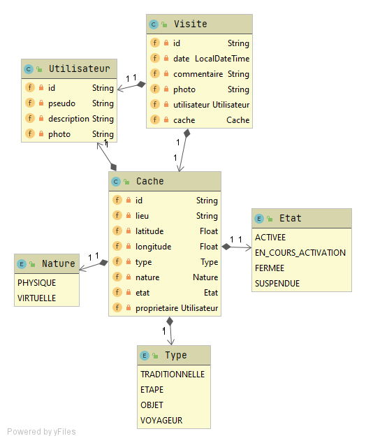

# IG2I-LA2-POO-GEOCACHE
*Mathis Haloy - François Dourlens-Monchy*

## Lancement

A la racine du projet :

```bash
mvn clean install
java -jar target/*.jar
```

## Architecture

### UML et Métier

Notre projet possède l'arborescence suivante : 

```
├───application
├───domain
│   ├───cache
│   ├───utilisateur
│   └───visite
├───infrastructure
│   └───mysql
│       ├───cache
│       ├───utilisateur
│       └───visite
└───services
```
Le package `application` contient les classes de présentation et d'interface console. Celles-ci utilisent des implémentations de `services` contenues dans le package du même nom.
Ces services implémentes des interfaces du `domain`, le quel contient également nos classes métiers et la définition des interfaces de repository. Les `services` utilisent ces repository qui sonbt implémentés dans le package `infrastructure`.
On possède ainsi une découpe 3-tiers entre :
+ La couche de présentation `application`
+ La couche métier qui possède les classes et services métiers `domain` et `services`
+ La couche d'accès aux données `infrastrucutre`

Ainsi les classes métiers sont utilisées dans toutes les couches, la couche d'accès aux données n'a pas connaissance de la couche de présentation et inversement.



### Springboot

Dans ce nos projet nous avons utilisé le framework springboot qui permet de lancer l'application et de manipuler nos classes Java
afin d'injecter les dépendances automatiquements. Globalement, quand on définit l'attribut `cacheService` suivant dans la classe ```GeocacheConsole```
```java
@Component
@RequiredArgsConstructor
public class GeocacheConsole implements CommandLineRunner {

    private final CacheService cacheService;
    
    // ...
}
```
Alors sprinboot va scanner l'ensemble du projet afin de trouver une implémentation de cette interface ```CacheService```
afin de l'y injecter. Rien de si magique puisque Spring va appeler le constructeur définit par l'annotation `@RequiredArgsConstructor` de lombok
qui génère le code du constructeur au moment de la compilation comme suit :

```java
public GeocacheConsole(CacheService cacheService) {
    this.cacheService = cacheService;
}
```
Springboot va donc appeler ce constructeur au moment où il manipulera la classe `GeocacheConsole` en injectant l'implémentation
de l'interface `CacheService`, dans le cas présent `CacheServiceImpl`. Spring reconnait cette implémentation grace à l'annotation
`@Service` qu'elle possède : (`@Service`, `@Repository` et `@Component` servent à marquer une classe comme injectable)
```java
@Service
@RequiredArgsConstructor
public class CacheServiceImpl implements CacheService {

    private final CacheRepository cacheRepository;
    
    // ...
}
```
Etant donc manipulée par Spring, l'attribut `CacheRepository` de cette classe se verra donc injecté avec l'implémentation candidate aqéuate
de la même manière que précedemment etc ...